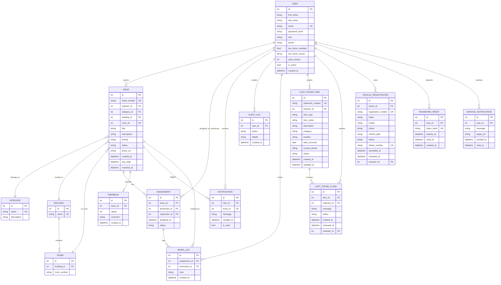

# CampusFix ER Diagram

```mermaid
erDiagram
    USER ||--o{ ISSUE : reports
    USER ||--o{ ASSIGNMENT : assigned_as_technician
    USER ||--o{ NOTIFICATION : receives
    USER ||--o{ AUDIT_LOG : creates
    USER ||--o{ WORK_LOG : writes
    USER ||--o{ LOST_FOUND_ITEM : reports
    USER ||--o{ LOST_FOUND_CLAIM : submits
    USER ||--o{ VEHICLE_REGISTRATION : owns
    USER ||--o{ PASSWORD_RESET : requests
    USER ||--o{ SERVICE_NOTIFICATION : receives

    ISSUE }o--|| CATEGORY : belongs_to
    ISSUE }o--|| BUILDING : located_in
    ISSUE }o--|| ROOM : at_room
    ISSUE ||--o{ ASSIGNMENT : has
    ISSUE ||--o| FEEDBACK : includes
    ISSUE ||--o{ NOTIFICATION : triggers
    ISSUE ||--o{ WORK_LOG : tracked_by

    BUILDING ||--o{ ROOM : contains
    ASSIGNMENT ||--o{ WORK_LOG : logs
    LOST_FOUND_ITEM ||--o{ LOST_FOUND_CLAIM : receives

    USER {
        int id PK
        string first_name
        string last_name
        string email UK
        string password_hash
        string role
        string phone
        bool two_factor_enabled
        string two_factor_secret
        int auth_version
        bool is_active
        datetime created_at
    }

    CATEGORY {
        int id PK
        string name UK
        string description
    }

    BUILDING {
        int id PK
        string name UK
    }

    ROOM {
        int id PK
        int building_id FK
        string room_number
    }

    ISSUE {
        int id PK
        string ticket_number UK
        int reporter_id FK
        int category_id FK
        int building_id FK
        int room_id FK
        string title
        string description
        string priority
        string status
        string photo_url
        datetime created_at
        datetime due_date
        datetime resolved_at
    }

    ASSIGNMENT {
        int id PK
        int issue_id FK
        int technician_id FK
        int supervisor_id FK
        datetime assigned_at
        string status
    }

    WORK_LOG {
        int id PK
        int assignment_id FK
        int technician_id FK
        string note
        datetime created_at
    }

    FEEDBACK {
        int id PK
        int issue_id FK
        int rating
        string comment
        datetime created_at
    }

    NOTIFICATION {
        int id PK
        int user_id FK
        int issue_id FK
        string message
        datetime created_at
        bool is_read
    }

    AUDIT_LOG {
        int id PK
        int user_id FK
        string action
        string details
        datetime created_at
    }

    LOST_FOUND_ITEM {
        int id PK
        string reference_number UK
        int reporter_id FK
        string item_type
        string item_name
        string description
        string category
        string location
        date date_occurred
        string contact_phone
        string status
        datetime created_at
        datetime updated_at
    }

    LOST_FOUND_CLAIM {
        int id PK
        int item_id FK
        int claimant_id FK
        string message
        string status
        datetime created_at
        datetime reviewed_at
        int reviewer_id FK
    }

    VEHICLE_REGISTRATION {
        int id PK
        int owner_id FK
        string registration_number UK
        string make
        string model
        string colour
        string vehicle_type
        string status
        string sticker_number UK
        datetime submitted_at
        datetime reviewed_at
        int reviewer_id FK
    }

    PASSWORD_RESET {
        int id PK
        int user_id FK
        string token_hash UK
        datetime expires_at
        datetime used_at
        datetime created_at
    }

    SERVICE_NOTIFICATION {
        int id PK
        int user_id FK
        string message
        string target_url
        datetime created_at
        datetime read_at
    }
```
